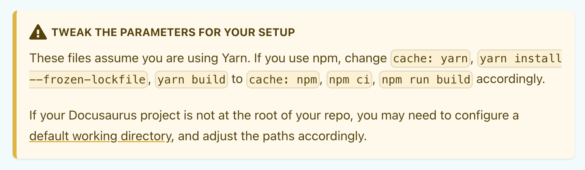
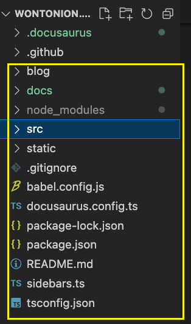
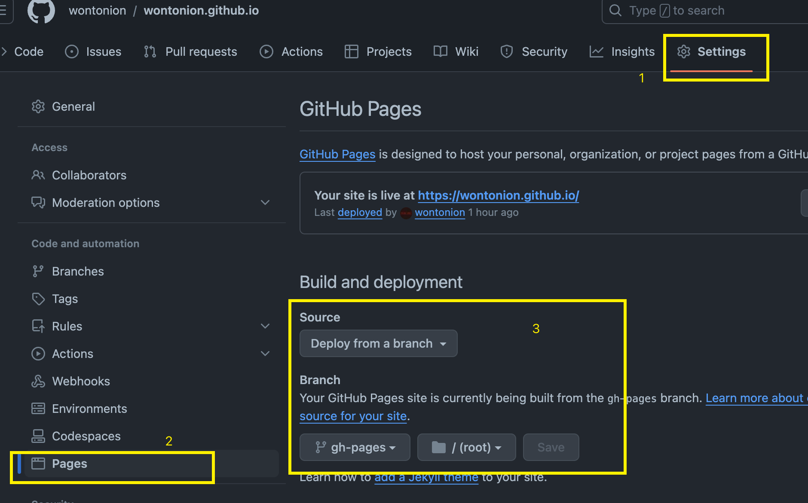
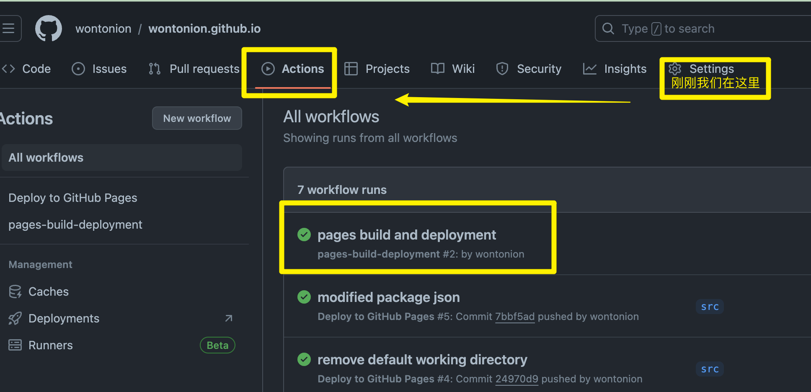

# this is my first self-made markdown blog

This blog is going to teach everyone how to build a github blog with URL like `username.github.io` with a popular document framework Docusaurus.

创建博客之前，我们应该先做一些准备：
1. Github帐号
2. 配置了和github互通的git环境，或者使用github desktop
3. 一个终端
4. vscode 或其他编辑器
5. 需要配置一下本地的nodejs环境，需要使用到npm这样的nodejs包管理工具，可自行搜索nodejs和npm的安装方式。npm在windows下有点问题，可以使用yarn。

原理解释：
1. 根据这个[链接](https://pages.github.com/)上的介绍，所有的github帐号都可以使用`username.github.io`这样一个网址来当作自己的免费域名。实现方法很简单，只需要创建一个名为`username.github.io`的repo即可

具体步骤：
1. 可以先在github上创建一个`username.github.io`的仓库
2. 使用git 命令/github desktop，把仓库拉取到本地。
3. 进入仓库路径
4. 根据[官方文档](https://docusaurus.io/docs/installation)的命令`npx create-docusaurus@latest my-website classic` 创建docursaurus应用，可以直接起名`my-website`，这个文件夹等下会删掉，问题不大，本文以该命令为准，使用`my-website`作为项目名称。
5. 根据[官方文档](https://docusaurus.io/docs/deployment#triggering-deployment-with-github-actions)，在仓库目录中创建`.github`和`.github/workflows`两个文件夹。
6. 在`.github/workflows`中，创建上面文档中的两个文件`github/workflows/deploy.yml`和`.github/workflows/test-deploy.yml`，其中这两个文件中的`yarn`命令需要根据自己的包管理工具进行修改，修改方式见下图
   

7. 完成以上步骤后，把`my-website`中的所有文件剪切处理，放到和`.github`同一层下，如下图。然后可以删除空文件夹`my-website`

8. 把仓库push到github上
9. push完成后浏览器登录账户，进入该仓库，进行如下配置

在该步骤中，可能步骤3的gh-pages没得选，需要暂时等待github完成才会出现，可以进入这里查看github action的编译进度。首次编译成功才会出现该分支。

10. 如果以上步骤顺利，等待github action编译完成就可以直接在浏览器地址栏输入网址`username.github.io`进行查看，现在应该看到的是docusaurus的tutorilal页面。`username`当然是你自己的github账户名字，不会看到这里才明白吧。